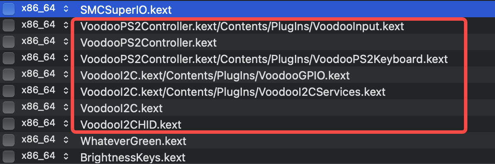

# Hackintosh-LEGION-Y7000P-I7-8750H  
> 联想拯救者 Y7000P I7-8750H  准完美级 EFI	 
> 镜像系统版本为 macOS Monterey 12.1 21C52

在 [gclm](https://github.com/gclm/Hackintosh-LEGION-Y7000P-I7-9750H) 
提供的EFI上针对自己的机型做了修改，该OC引导在 macOS 12.1中，无法使本机型内置键盘生效，经自己修复已正常使用。 

## 电脑配置

```
电脑型号			联想 Lenovo 拯救者 Y7000P-1060 笔记本电脑
处理器			英特尔 Core i7-8750H @ 2.20GHz 六核
主板			联想 LNVNB161216 ( HM370 芯片组 )
显卡			英特尔 UHD Graphics 630 \ Nvidia GeForce GTX 1060 ( 6 GB / 联想 )
内存			8 GB ( 三星 DDR4 2666MHz )
主硬盘			三星 MZVLB512HAJQ-000L2 ( 512 GB / 固态硬盘 )
声卡			瑞昱  @ 英特尔 High Definition Audio 控制器
无线网卡			英特尔 Wireless-AC 9560
网卡			瑞昱 RTL8168/8111/8112 Gigabit Ethernet Controller
声卡			瑞昱  @ 英特尔 High Definition Audio 控制器
笔记本键盘		PS/2 标准键盘
```

## 正常工作的功能
- UEFI通过 Clover/OC 启动
- 蓝牙（更换白果卡BCM94360CD）
- 触控板 （全系支持全手势）
- 内置键盘以及数字键盘
- 背光控制
- 背光键盘
- AppleHDA原生音频，包括耳机
- 原生USB3.0/USB2.0 
- 原生电源管理
- 核显驱动（独显已经 hotpatch 屏蔽）
- 有线以太网卡
- 无线网络（更换白果卡BCM94360CD）
- CPU变频
- 支持休眠唤醒（hibernatemode 25）
- 睡眠唤醒（鼠标，键盘、电源键唤醒均正常）
- 随航（有线/无线）
- 电池状态
- 内置摄像头
- 4K 屏幕（[教程](https://github.com/xiaoMGitHub/LEGION_Y7000Series_Hackintosh/tree/master/4K_Display_Config)）
- iMessage/FaceTime
- 迁移助理
- Mac App Store正常运行

## 不能正常使用的功能
- HDMI ，因为HDMI 端口连接到已禁用的Nvidia卡
- Airdrop，无线网卡硬件暂不支持。
- MAC系统更新。(暂不支持)


## 修复记录
- 键盘失灵修复：

	由于keys中VoodooPS2Controller 和 VoodooI2C其中一个无法使内置键盘功能生效， 而同时加载这两项又会引发冲突，导致无法开机使用。
  	解决方法：使用OpenCore configurator，编辑kernel内核设置即可，按照如下配置即可。
	
  	即配置表中去除如下三个选项即可。
  ```
  VoodooI2C.kext/Contents/PlugIns/VoodooInput.kext
  VoodooPS2Controller.kext/Contents/PlugIns/VoodooPS2Mouse.kext
  VoodooPS2Controller.kext/Contents/PlugIns/VoodooPS2Trackpad.kext
  ```
- 小键盘修复：
	ACPI增加文件 SSDT-NumLock.aml


## 致谢

感谢 [国光](https://apple.sqlsec.com/) 提供的详细教程	 
感谢 [黑果小兵](https://blog.daliansky.net/) 提供的镜像文件及安装工具	 
感谢 [gclm](https://github.com/gclm/Hackintosh-LEGION-Y7000P-I7-9750H) 提供的绝大部分核心驱动 	
感谢 [xiaoM](https://github.com/xiaoMGitHub/LEGION_Y7000Series_Hackintosh/releases) 提供的键盘修复方案


